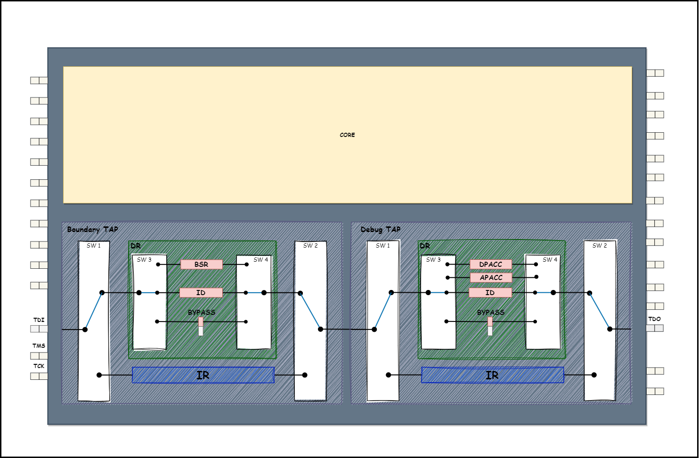
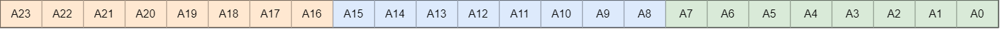
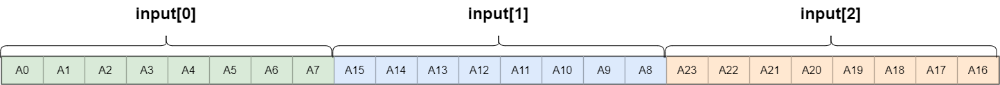
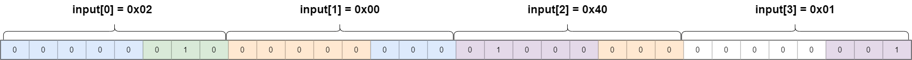

![Build with PlatformIO](https://img.shields.io/badge/build%20with-PlatformIO-orange?logo=data%3Aimage%2Fsvg%2Bxml%3Bbase64%2CPHN2ZyB3aWR0aD0iMjUwMCIgaGVpZ2h0PSIyNTAwIiB2aWV3Qm94PSIwIDAgMjU2IDI1NiIgeG1sbnM9Imh0dHA6Ly93d3cudzMub3JnLzIwMDAvc3ZnIiBwcmVzZXJ2ZUFzcGVjdFJhdGlvPSJ4TWlkWU1pZCI+PHBhdGggZD0iTTEyOCAwQzkzLjgxIDAgNjEuNjY2IDEzLjMxNCAzNy40OSAzNy40OSAxMy4zMTQgNjEuNjY2IDAgOTMuODEgMCAxMjhjMCAzNC4xOSAxMy4zMTQgNjYuMzM0IDM3LjQ5IDkwLjUxQzYxLjY2NiAyNDIuNjg2IDkzLjgxIDI1NiAxMjggMjU2YzM0LjE5IDAgNjYuMzM0LTEzLjMxNCA5MC41MS0zNy40OUMyNDIuNjg2IDE5NC4zMzQgMjU2IDE2Mi4xOSAyNTYgMTI4YzAtMzQuMTktMTMuMzE0LTY2LjMzNC0zNy40OS05MC41MUMxOTQuMzM0IDEzLjMxNCAxNjIuMTkgMCAxMjggMCIgZmlsbD0iI0ZGN0YwMCIvPjxwYXRoIGQ9Ik0yNDkuMzg2IDEyOGMwIDY3LjA0LTU0LjM0NyAxMjEuMzg2LTEyMS4zODYgMTIxLjM4NkM2MC45NiAyNDkuMzg2IDYuNjEzIDE5NS4wNCA2LjYxMyAxMjggNi42MTMgNjAuOTYgNjAuOTYgNi42MTQgMTI4IDYuNjE0YzY3LjA0IDAgMTIxLjM4NiA1NC4zNDYgMTIxLjM4NiAxMjEuMzg2IiBmaWxsPSIjRkZGIi8+PHBhdGggZD0iTTE2MC44NjkgNzQuMDYybDUuMTQ1LTE4LjUzN2M1LjI2NC0uNDcgOS4zOTItNC44ODYgOS4zOTItMTAuMjczIDAtNS43LTQuNjItMTAuMzItMTAuMzItMTAuMzJzLTEwLjMyIDQuNjItMTAuMzIgMTAuMzJjMCAzLjc1NSAyLjAxMyA3LjAzIDUuMDEgOC44MzdsLTUuMDUgMTguMTk1Yy0xNC40MzctMy42Ny0yNi42MjUtMy4zOS0yNi42MjUtMy4zOWwtMi4yNTggMS4wMXYxNDAuODcybDIuMjU4Ljc1M2MxMy42MTQgMCA3My4xNzctNDEuMTMzIDczLjMyMy04NS4yNyAwLTMxLjYyNC0yMS4wMjMtNDUuODI1LTQwLjU1NS01Mi4xOTd6TTE0Ni41MyAxNjQuOGMtMTEuNjE3LTE4LjU1Ny02LjcwNi02MS43NTEgMjMuNjQzLTY3LjkyNSA4LjMyLTEuMzMzIDE4LjUwOSA0LjEzNCAyMS41MSAxNi4yNzkgNy41ODIgMjUuNzY2LTM3LjAxNSA2MS44NDUtNDUuMTUzIDUxLjY0NnptMTguMjE2LTM5Ljc1MmE5LjM5OSA5LjM5OSAwIDAgMC05LjM5OSA5LjM5OSA5LjM5OSA5LjM5OSAwIDAgMCA5LjQgOS4zOTkgOS4zOTkgOS4zOTkgMCAwIDAgOS4zOTgtOS40IDkuMzk5IDkuMzk5IDAgMCAwLTkuMzk5LTkuMzk4em0yLjgxIDguNjcyYTIuMzc0IDIuMzc0IDAgMSAxIDAtNC43NDkgMi4zNzQgMi4zNzQgMCAwIDEgMCA0Ljc0OXoiIGZpbGw9IiNFNTcyMDAiLz48cGF0aCBkPSJNMTAxLjM3MSA3Mi43MDlsLTUuMDIzLTE4LjkwMWMyLjg3NC0xLjgzMiA0Ljc4Ni01LjA0IDQuNzg2LTguNzAxIDAtNS43LTQuNjItMTAuMzItMTAuMzItMTAuMzItNS42OTkgMC0xMC4zMTkgNC42Mi0xMC4zMTkgMTAuMzIgMCA1LjY4MiA0LjU5MiAxMC4yODkgMTAuMjY3IDEwLjMxN0w5NS44IDc0LjM3OGMtMTkuNjA5IDYuNTEtNDAuODg1IDIwLjc0Mi00MC44ODUgNTEuODguNDM2IDQ1LjAxIDU5LjU3MiA4NS4yNjcgNzMuMTg2IDg1LjI2N1Y2OC44OTJzLTEyLjI1Mi0uMDYyLTI2LjcyOSAzLjgxN3ptMTAuMzk1IDkyLjA5Yy04LjEzOCAxMC4yLTUyLjczNS0yNS44OC00NS4xNTQtNTEuNjQ1IDMuMDAyLTEyLjE0NSAxMy4xOS0xNy42MTIgMjEuNTExLTE2LjI4IDMwLjM1IDYuMTc1IDM1LjI2IDQ5LjM2OSAyMy42NDMgNjcuOTI2em0tMTguODItMzkuNDZhOS4zOTkgOS4zOTkgMCAwIDAtOS4zOTkgOS4zOTggOS4zOTkgOS4zOTkgMCAwIDAgOS40IDkuNCA5LjM5OSA5LjM5OSAwIDAgMCA5LjM5OC05LjQgOS4zOTkgOS4zOTkgMCAwIDAtOS4zOTktOS4zOTl6bS0yLjgxIDguNjcxYTIuMzc0IDIuMzc0IDAgMSAxIDAtNC43NDggMi4zNzQgMi4zNzQgMCAwIDEgMCA0Ljc0OHoiIGZpbGw9IiNGRjdGMDAiLz48L3N2Zz4=)

# ArduJtag: Simple Library for Working with JTAG

ArduJtag is a lightweight and easy-to-use library for interfacing with JTAG devices using Arduino boards. This library provides a way to communicate with JTAG compatible devices. It is designed during work on [Diving into JTAG protocol](https://medium.com/@aliaksandr.kavalchuk/diving-into-jtag-protocol-part-1-overview-fbdc428d3a16) articles and was used to study this protocol.

## Features

- Control JTAG pins (TCK, TMS, TDI, TDO) directly from your Arduino
- Simple API for sending and receiving data
- Support for JTAG sequences and operations
- Configurable communication speed

## Install

- Clone this repository into Arduino/Libraries or use the built-in Arduino IDE Library manager to install a copy of this library.

- Include in your sketch

```c
#include "Jtag.hpp"
```

### Install Using PlatformIO

Install ArduJtag using the platformio library manager in your editor, or using the PlatformIO Core CLI, or by adding it to your platformio.ini as shown below:

```shell
[env]
lib_deps =
    ArduJtag
[env]
lib_deps =
    https://github.com/Zamuhrishka/ArduJtag.git
```

## Usage

To demonstrate the use of this library, I will show how to interact with the STM32F407 microcontroller via the JTAG interface.
This microcontroller contains 2 TAP modules connected in series: **BoundaryScan** and **Debug**:



The size of the `IR` register for the **BoundaryScan** TAP is `5` bits. For the **Debug** TAP, it is `4` bits.

### Write into IR register

For writing into the `IR` register, the following function is used:

```c
  /**
   * \brief Send an instruction through the JTAG IR (Instruction Register)
   *
   * \param instruction The instruction code to be sent
   * \param length The length of the instruction in bits
   */
  void ir(uint16_t instruction, uint16_t length);
```

Let's look at what arguments need to be passed to this function to set the `BYPASS` instruction in the **BoundaryScan** TAP, and the `IDCODE` instruction in the **Debug** TAP.
Considering the arrangement of the **BoundaryScan** TAP and **Debug** TAP in the scan chain: **BoundaryScan** TAP is first - **Debug** TAP is second, and the fact that in JTAG data is transmitted least significant bit first, it turns out that for our purpose we need to write in the `IR` **BoundaryScan** TAP the value `0x1F` (`0b11111`), and in the `IR` **Debug** TAP - `0x0E` (`0b1110`). As a result, the bit sequence that needs to be set on the `TDI` line looks like this (remembering that in JTAG data is transmitted least significant bit first):

```c
TDI: 011111111
```

The values of the arguments:

```c
  uint16_t instruction = 0;
  uint16_t length = 0;
  ir(instruction = 0x1FE, length = 9);
```

### Write into DR register

For writing into `DR` register the next function used:

```c
  /**
   * \brief Send data through the JTAG DR (Data Register)
   *
   * \param data Pointer to the data array to be sent
   * \param length The length of the data in bits
   * \param output Pointer to the buffer where the response will be stored
   */
  void dr(uint8_t *input, uint32_t length, uint8_t *output);
```

The formation of the input buffer occurs as follows, suppose you need to send the following bit sequence:



Then the `input` array should look like this:



The same transformation applies to the `output` array.

Let's consider a more specific example. Suppose it is necessary to send the following bit sequence into the `DR` register:


Then the `input` array should look like this:



```c
  uint8_t input = {0x02, 0x00, 0x40, 0x01};
  uint8_t length = 0;
  uint8_t input = {0x00, 0x00, 0x00, 0x00};

  void dr(input, length = 27, output);
```

### Forming Arbitrary Bit Sequences

To form an arbitrary JTAG packet, the following function is intended:

```c
/**
   * \brief Perform a sequence of JTAG operations (a series of bit manipulations on TMS and TDI
   *        reading TDO)
   *
   * \param n Number of operations in the sequence
   * \param tms Array of TMS values for the sequence
   * \param tdi Array of TDI values for the sequence
   * \param tdo Pointer to the array where TDO values will be stored
   * \return JTAG::ERROR Status of the sequence operation
   */
  JTAG::ERROR sequence(size_t n, const uint8_t tms[], const uint8_t tdi[], uint8_t *tdo);
```

The principle of forming arrays `tms`, `tdi`, `tdo` is exactly the same as for the `input` and `output` arrays described in the previous section.

More examples of using this library can be found in [examples](./examples/).

## Contributing

Bug reports and/or pull requests are welcome.

## Disclaimer

This software is provided 'as-is', without any express or implied warranty. In no event will the authors be held liable for any damages arising from the use of this software.
