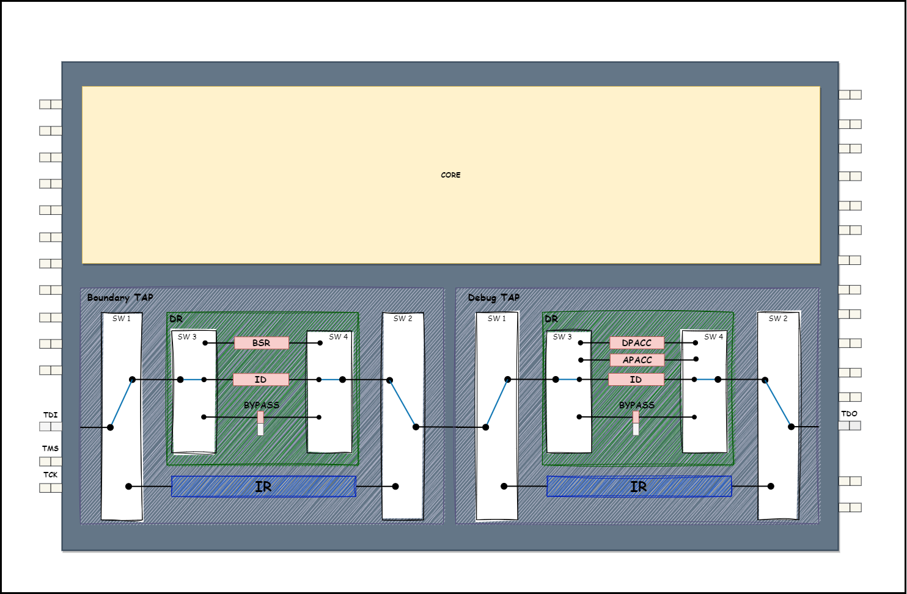

![Build with PlatformIO](https://img.shields.io/badge/build%20with-PlatformIO-orange?logo=data%3Aimage%2Fsvg%2Bxml%3Bbase64%2CPHN2ZyB3aWR0aD0iMjUwMCIgaGVpZ2h0PSIyNTAwIiB2aWV3Qm94PSIwIDAgMjU2IDI1NiIgeG1sbnM9Imh0dHA6Ly93d3cudzMub3JnLzIwMDAvc3ZnIiBwcmVzZXJ2ZUFzcGVjdFJhdGlvPSJ4TWlkWU1pZCI+PHBhdGggZD0iTTEyOCAwQzkzLjgxIDAgNjEuNjY2IDEzLjMxNCAzNy40OSAzNy40OSAxMy4zMTQgNjEuNjY2IDAgOTMuODEgMCAxMjhjMCAzNC4xOSAxMy4zMTQgNjYuMzM0IDM3LjQ5IDkwLjUxQzYxLjY2NiAyNDIuNjg2IDkzLjgxIDI1NiAxMjggMjU2YzM0LjE5IDAgNjYuMzM0LTEzLjMxNCA5MC41MS0zNy40OUMyNDIuNjg2IDE5NC4zMzQgMjU2IDE2Mi4xOSAyNTYgMTI4YzAtMzQuMTktMTMuMzE0LTY2LjMzNC0zNy40OS05MC41MUMxOTQuMzM0IDEzLjMxNCAxNjIuMTkgMCAxMjggMCIgZmlsbD0iI0ZGN0YwMCIvPjxwYXRoIGQ9Ik0yNDkuMzg2IDEyOGMwIDY3LjA0LTU0LjM0NyAxMjEuMzg2LTEyMS4zODYgMTIxLjM4NkM2MC45NiAyNDkuMzg2IDYuNjEzIDE5NS4wNCA2LjYxMyAxMjggNi42MTMgNjAuOTYgNjAuOTYgNi42MTQgMTI4IDYuNjE0YzY3LjA0IDAgMTIxLjM4NiA1NC4zNDYgMTIxLjM4NiAxMjEuMzg2IiBmaWxsPSIjRkZGIi8+PHBhdGggZD0iTTE2MC44NjkgNzQuMDYybDUuMTQ1LTE4LjUzN2M1LjI2NC0uNDcgOS4zOTItNC44ODYgOS4zOTItMTAuMjczIDAtNS43LTQuNjItMTAuMzItMTAuMzItMTAuMzJzLTEwLjMyIDQuNjItMTAuMzIgMTAuMzJjMCAzLjc1NSAyLjAxMyA3LjAzIDUuMDEgOC44MzdsLTUuMDUgMTguMTk1Yy0xNC40MzctMy42Ny0yNi42MjUtMy4zOS0yNi42MjUtMy4zOWwtMi4yNTggMS4wMXYxNDAuODcybDIuMjU4Ljc1M2MxMy42MTQgMCA3My4xNzctNDEuMTMzIDczLjMyMy04NS4yNyAwLTMxLjYyNC0yMS4wMjMtNDUuODI1LTQwLjU1NS01Mi4xOTd6TTE0Ni41MyAxNjQuOGMtMTEuNjE3LTE4LjU1Ny02LjcwNi02MS43NTEgMjMuNjQzLTY3LjkyNSA4LjMyLTEuMzMzIDE4LjUwOSA0LjEzNCAyMS41MSAxNi4yNzkgNy41ODIgMjUuNzY2LTM3LjAxNSA2MS44NDUtNDUuMTUzIDUxLjY0NnptMTguMjE2LTM5Ljc1MmE5LjM5OSA5LjM5OSAwIDAgMC05LjM5OSA5LjM5OSA5LjM5OSA5LjM5OSAwIDAgMCA5LjQgOS4zOTkgOS4zOTkgOS4zOTkgMCAwIDAgOS4zOTgtOS40IDkuMzk5IDkuMzk5IDAgMCAwLTkuMzk5LTkuMzk4em0yLjgxIDguNjcyYTIuMzc0IDIuMzc0IDAgMSAxIDAtNC43NDkgMi4zNzQgMi4zNzQgMCAwIDEgMCA0Ljc0OXoiIGZpbGw9IiNFNTcyMDAiLz48cGF0aCBkPSJNMTAxLjM3MSA3Mi43MDlsLTUuMDIzLTE4LjkwMWMyLjg3NC0xLjgzMiA0Ljc4Ni01LjA0IDQuNzg2LTguNzAxIDAtNS43LTQuNjItMTAuMzItMTAuMzItMTAuMzItNS42OTkgMC0xMC4zMTkgNC42Mi0xMC4zMTkgMTAuMzIgMCA1LjY4MiA0LjU5MiAxMC4yODkgMTAuMjY3IDEwLjMxN0w5NS44IDc0LjM3OGMtMTkuNjA5IDYuNTEtNDAuODg1IDIwLjc0Mi00MC44ODUgNTEuODguNDM2IDQ1LjAxIDU5LjU3MiA4NS4yNjcgNzMuMTg2IDg1LjI2N1Y2OC44OTJzLTEyLjI1Mi0uMDYyLTI2LjcyOSAzLjgxN3ptMTAuMzk1IDkyLjA5Yy04LjEzOCAxMC4yLTUyLjczNS0yNS44OC00NS4xNTQtNTEuNjQ1IDMuMDAyLTEyLjE0NSAxMy4xOS0xNy42MTIgMjEuNTExLTE2LjI4IDMwLjM1IDYuMTc1IDM1LjI2IDQ5LjM2OSAyMy42NDMgNjcuOTI2em0tMTguODItMzkuNDZhOS4zOTkgOS4zOTkgMCAwIDAtOS4zOTkgOS4zOTggOS4zOTkgOS4zOTkgMCAwIDAgOS40IDkuNCA5LjM5OSA5LjM5OSAwIDAgMCA5LjM5OC05LjQgOS4zOTkgOS4zOTkgMCAwIDAtOS4zOTktOS4zOTl6bS0yLjgxIDguNjcxYTIuMzc0IDIuMzc0IDAgMSAxIDAtNC43NDggMi4zNzQgMi4zNzQgMCAwIDEgMCA0Ljc0OHoiIGZpbGw9IiNGRjdGMDAiLz48L3N2Zz4=)

# ArduJTAG

ArduJTAG is an Arduino library for communicating with JTAG devices through GPIO.
It provides direct IR/DR scans and explicit clock sequences, along with a chain
API for addressing individual devices using named instruction profiles.
Buffers and chain storage have fixed capacities and do not require heap allocation.

The project is grew out of the [Diving into JTAG protocol](https://medium.com/@aliaksandr.kavalchuk/diving-into-jtag-protocol-part-1-overview-fbdc428d3a16) article.

## Features

- Packed `BitBuffer` data with exact bit lengths and bounds checks.
- Direct IR/DR transfers, TAP reset and explicit TMS/TDI clock sequences.
- Device chains with automatic BYPASS padding and target response extraction.
- Named instruction profiles with validation of device identity and DR lengths.
- A four-bit ARM JTAG-DP profile and a `readIdcode()` helper.
- Standard boundary-scan helpers for device-specific profiles.
- Configurable JTAG clock speed and optional per-clock serial tracing.
- Host tests for buffers, protocol sequences, chain operations and GPIO sampling.

## API overview

| Class | Purpose |
| --- | --- |
| `BitBuffer<Capacity>` | Stores packed bits and their active length; capacity is in bits. |
| `Jtag` | Performs whole-chain IR/DR scans, explicit clock sequences and TAP reset. |
| `JtagDevice` | Describes a device's IR length and optional instruction profile. |
| `JtagChain<MaxDevices, Capacity>` | Addresses a target by index and puts other devices in BYPASS. |
| `JtagDeviceAccess<Profile, Chain>` | Provides named operations on one device, including `readIdcode()` and profile-supported boundary-scan commands. |

`JtagGpio` and `GpioPin` implement the GPIO backend. Applications normally use
`Jtag` directly or through `JtagChain`.

## Install

For a PlatformIO Arduino project, add this repository to the environment's
`lib_deps` in `platformio.ini`:

```ini
[env:nanoatmega328new]
platform = atmelavr
board = nanoatmega328new
framework = arduino
lib_deps =
    https://github.com/Zamuhrishka/ArduJTAG.git
```

Include `Jtag.hpp` for direct operations or `JtagChain.hpp` for the chain API.
Named commands also require their profile header, such as
`profiles/ArmJtagDp.hpp`. To build this repository itself, follow
[Development setup](#development-setup) and [Build firmware](#build-firmware).

## Examples

The [example guide](examples/README.md) describes all eight sketches, their output,
target configuration and how to select and upload them:

- **Direct `Jtag`:** ReadId, ReadIdSequence and EnableArmDap.
- **`JtagChain`:** ReadIdChain, TransferChain, BypassChain, EnableArmDapChain and
  BoundaryScanCommands.

Start with **ReadIdChain** to read the Debug TAP IDCODE, then **TransferChain**
to work with request and response buffers explicitly. For another target board,
adapt the chain layout, instruction opcodes, register lengths and device-specific
payloads as well as the wiring. **BoundaryScanCommands** uses a teaching profile
and must be configured before use, including on STM32F4-Discovery.

## Usage

To demonstrate the use of this library, I will show how to interact with the STM32F407 microcontroller via the JTAG interface.
This microcontroller contains 2 TAP modules connected in series: **BoundaryScan** and **Debug**:



The size of the `IR` register for the **BoundaryScan** TAP is `5` bits. For the **Debug** TAP, it is `4` bits.
Devices are described in physical TDI-to-TDO order. The low-level API requires
you to pack the entire chain.

`JtagChain` handles that packing for one target.

The snippets below assume this controller configuration:

```cpp
#include <Jtag.hpp>

Jtag jtag(3, 4, 5, 2, 6); // TMS, TDI, TDO, TCK, nTRST
```

Call `jtag.reset()` before the first scan or when the TAP state is unknown. IR/DR operations finish in Run-Test/Idle. `reset()` enters Test-Logic-Reset. The `clockCycles()` leaves the TAP in the state selected by your TMS sequence.

### Write into IR register

For writing into the `IR` register, the following function is used:

```cpp
  template <size_t Capacity>
  JTAG::ERROR ir(const BitBuffer<Capacity> &instruction);
```

Let's look at what arguments need to be passed to this function to set the `BYPASS` instruction in the **BoundaryScan** TAP, and the `IDCODE` instruction in the **Debug** TAP.
Considering the arrangement of the **BoundaryScan** TAP and **Debug** TAP in the scan chain: **BoundaryScan** TAP is first - **Debug** TAP is second, and the fact that in JTAG data is transmitted least significant bit first, it turns out that for our purpose we need to write in the `IR` **BoundaryScan** TAP the value `0x1F` (`0b11111`), and in the `IR` **Debug** TAP - `0x0E` (`0b1110`). As a result, the bit sequence that needs to be set on the `TDI` line looks like this (remembering that in JTAG data is transmitted least significant bit first):

```cpp
TDI: 011111111
```

The values of the arguments:

```cpp
  auto instruction = BitBuffer<9>::fromBits("011111111");
  jtag.ir(instruction);
```

For another target with a 24-bit combined IR, the same API accepts three bytes:

```cpp
auto instruction = BitBuffer<24>::fromBytes({0xFE, 0x01, 0xA5});
JTAG::ERROR status = jtag.ir(instruction);
```

The buffer length determines the number of instruction bits. Bytes are sent in
array order, least significant bit first, and the operation finishes in
Run-Test/Idle. An empty buffer returns `INVALID_BUFFER` without generating clocks.
The operation returns `JTAG::ERROR::NO` on success.

### Write into DR register

`BitBuffer<Capacity>` stores packed bytes and an exact bit count without heap
allocation. Capacity is in bits (256 by default; supported range 1..32767).
Include `Jtag.hpp` to use it.

```cpp
// The leftmost character is the FIRST bit transmitted on TDI.
auto input = BitBuffer<>::fromBits("1010101000000110");

// Equivalent: bytes in array order, least significant bit first within each byte.
auto bytes = BitBuffer<>::fromBytes({0x55, 0x60});
```

To read the Debug TAP IDCODE directly, shift 33 DR bits: 32 target bits plus
one BYPASS bit for the BoundaryScan TAP.

```cpp
auto input = BitBuffer<33>::fromBytes({0, 0, 0, 0, 0}, 33);
BitBuffer<33> output;
jtag.reset();
auto instruction = BitBuffer<9>::fromBits("011111111");
jtag.ir(instruction); // Example instruction for the STM32F407 chain described above.
JTAG::ERROR status = jtag.dr(input, output);
if (status == JTAG::ERROR::NO)
{
  bool firstBit = output.getBit(0);
  uint8_t firstByte = output.byte(0);
  // output.bitCount() == 33; output.byteCount() == 5.
  // Bits 0..31 contain IDCODE; bit 32 belongs to the other TAP in BYPASS.
}
```

A bit string describes transmission order, not the usual written representation
of an integer. For a partial final byte, specify the exact bit count:

```cpp
auto input = BitBuffer<32>::fromBytes({0x55, 0x06}, 11);
// Sends all 8 bits of 0x55, followed by the 3 low bits of 0x06: 0, 1, 1.
BitBuffer<32> output;
jtag.dr(input, output);
```

Existing arrays can be copied with
`BitBuffer<32>::fromBytes(data, sizeof(data), bitCount)`.
Factories return an empty, invalid buffer for null input, empty input, invalid
bit characters, insufficient source bytes, or exceeded capacity; check `valid()`.
The `dr` overload returns `INVALID_BUFFER` without generating clocks if the input
is invalid or the output capacity is too small. Otherwise it sets the output
length to the input length. The first received bit is bit 0 of byte 0; unused
high bits in the last byte are zero. `getBit()` and `byte()` return zero outside the
active length; `set(index, value)` returns false for an out-of-range index.

### Forming Arbitrary Bit Sequences

Use `clockCycles()` with packed TMS and TDI buffers of equal active length:

```cpp
auto tms = BitBuffer<54>::fromBytes({0x06, 0x60, 0x01, 0x00, 0x00, 0x00, 0x0C}, 54);
auto tdi = BitBuffer<54>::fromBytes({0xC0, 0x3F, 0x00, 0x00, 0x00, 0x00, 0x00}, 54);
BitBuffer<54> tdo;
JTAG::ERROR status = jtag.clockCycles(tms, tdi, tdo);
```

The input bit count determines the number of TCK cycles. Buffers may have
different capacities; `tdo` must have room for all input bits. On success its
active length equals the input length. Bit packing is LSB-first, as in `dr()`.

Empty inputs, unequal input lengths, or insufficient output capacity return
`INVALID_BUFFER`. A cycle count above `JTAG::CONSTANTS::MAX_SEQUENCE_LEN`
returns `INVALID_SEQUENCE_LEN`. Validation failures leave all buffers unchanged
and generate no clocks.

See the [example guide](examples/README.md) for complete sketches and wiring.

## Working with a device chain

Include `JtagChain.hpp` to address one device while putting the others in
BYPASS. `JtagDevice` stores the IR length; `JtagChain<MaxDevices, Capacity>`
copies descriptions in physical **TDI-to-TDO order**. Targets are zero-based
indices in that order. There is no automatic discovery.

```cpp
#include <JtagChain.hpp>

Jtag jtag(3, 4, 5, 2, 6); // TMS, TDI, TDO, TCK, TRST
JtagChain<2, 40> chain(jtag);
if (!chain.add(JtagDevice(5)) || !chain.add(JtagDevice(4))) {
  return; // Invalid description, too many devices, or combined IR too long.
}
jtag.reset();
auto instruction = BitBuffer<4>::fromBits("0111"); // Debug TAP IDCODE, 0xE.
auto request = BitBuffer<32>::fromBytes({0, 0, 0, 0});
BitBuffer<32> response;
JTAG::ERROR status = chain.transfer(1, instruction, request, response);
```

See [TransferChain](examples/TransferChain/TransferChain.ino) for a complete
`transfer()` sketch with error handling, response output, and a raw-instruction
alternative.

See [EnableArmDapChain](examples/EnableArmDapChain/EnableArmDapChain.ino) for
the `EnableArmDap` register sequence expressed with named DPACC/APACC transfers.
Its requests and responses contain 35 target bits; the chain adds the BYPASS bit.
It preserves the original reset points; the final zero request also reloads
APACC because every `transfer()` programs IR. ACK/WAIT handling remains outside
this example.

### Named instruction profiles

A profile gives commands names without storing a command table in each device:

```cpp
#include <profiles/ArmJtagDp.hpp>

JtagChain<2, 40> namedChain(jtag);
if (!namedChain.add(JtagDevice(5)) ||
    !namedChain.add(JtagDevice::fromProfile<ArmJtagDp>())) {
  return;
}
jtag.reset();
JTAG::ERROR status = namedChain.transfer(
    1, ArmJtagDp::Instruction::Idcode, request, response);
```

Use `fromProfile<ArmJtagDp>()` instead of `JtagDevice(4)` when configuring that
device. A plain device has no profile, even if its IR length matches.
`ArmJtagDp` supports four-bit IR only and provides `Abort`, `Dpacc`, `Apacc`,
`Idcode`, and `Bypass`, using the encodings in the
[Arm JTAG-DP register summary](https://developer.arm.com/documentation/100536/0302/About-the-programmers-model/DAP-registers/JTAG-DP-registers/JTAG-DP-register-summary).
Eight-bit JTAG-DP variants require a different profile.

Named transfers return `INVALID_DEVICE` for an absent or mismatched profile,
`INVALID_INSTRUCTION` for unsupported enum values, and `INVALID_BUFFER` for a
wrong fixed DR length, before generating clocks or modifying output.
`ArmJtagDp::drLength()` specifies 35 bits for Abort/Dpacc/Apacc, 32 for Idcode,
and one for Bypass, matching the Arm register summary linked above.
These widths describe the target alone; the chain adds other devices' BYPASS bits.
The raw `BitBuffer` overload remains available for explicitly sized exchanges.
The caller still handles payload formats, response pipelines and ACKs.

To read IDCODE without creating request and response buffers:

```cpp
uint32_t idcode = 0;
auto debugPort = namedChain.device<ArmJtagDp>(1);
JTAG::ERROR status = debugPort.readIdcode(idcode);
if (status == JTAG::ERROR::NO) Serial.println(idcode, HEX);
```

`device<Profile>(index)` returns a `JtagDeviceAccess<Profile, Chain>` holding
only a reference to the chain and the index. The chain must outlive the access
object. `debugPort.valid()` checks the index and declared profile without clocks;
operations repeat those checks even if `valid()` was not called. Appending
other devices preserves the binding, and access objects can be copied.
`JtagDevice` remains a copied description; device operations live in the access
object, while `JtagChain` handles whole-chain transfers.

Named exchanges can also be issued through the access object:

```cpp
JTAG::ERROR status = debugPort.transfer(
    ArmJtagDp::Instruction::Idcode, request, response);
```

Both `chain.transfer(index, command, ...)` and the raw `BitBuffer` overload
remain available. `readIdcode()` is a device-access method.

The helper uses the profile's `Instruction::Idcode`, requires a fixed 32-bit DR,
sends zeros, and assembles the response in transmission order into `uint32_t`.
It leaves `idcode` unchanged on failure. The chain must have room for the 32
IDCODE bits plus all BYPASS bits. It does not reset the chain or check the value
against an expected device ID.

### Standard device operations

Complete sketches:

- [BypassChain](examples/BypassChain/BypassChain.ino): BYPASS on the existing ARM
  JTAG-DP profile, including the equivalent generic `select()` call.
- [BoundaryScanCommands](examples/BoundaryScanCommands/BoundaryScanCommands.ino):
  SAMPLE, PRELOAD, SAMPLE/PRELOAD, EXTEST, INTEST, HIGHZ, BYPASS and `select()`.
  Its local `ExampleBoundaryProfile.hpp` contains **teaching values, not a real
  device profile**. Replace the opcodes, IR/BSR lengths and vectors using your
  device's BSDL and board connections, then set `DeviceConfigured = true`.
  Until configured, the sketch prints a setup message and generates no JTAG clocks.
  It runs once; operations are explicit, with status checks and captured output.


`JtagDeviceAccess` also exposes these operations when the profile declares the
corresponding enum members and encodings:

| Method | Profile instruction | Exchange |
| --- | --- | --- |
| `bypass()` | `Bypass` | IR only |
| `highZ()` | `HighZ` | IR only |
| `sample(values, captured)` | `Sample` | IR + DR |
| `preload(values)` | `Preload` | IR + DR, captured bits discarded |
| `samplePreload(values, captured)` | `SamplePreload` | IR + DR |
| `extest(values, captured)` | `Extest` | IR + DR |
| `intest(values, captured)` | `Intest` | IR + DR |
| `select(instruction)` | Any supported instruction | IR only |

The data buffers contain the complete target register in transmission order.
Fixed DR lengths are checked before clocks. For combined SAMPLE/PRELOAD,
a profile can alias `Sample`, `Preload`, and `SamplePreload` to the same opcode.
`sample()` takes explicit input values because a combined instruction also
updates preload latches. It does not silently preload zeros.

Before the first `extest()`, call `preload(initialValues)` with values appropriate
for the device and board. EXTEST activates at Update-IR, before the method shifts
its new DR data. A typical sequence for a boundary-scan profile is:

```cpp
// boundary is an access object for a device-specific boundary-scan profile.
// initialValues and nextValues contain the full BSR, including control cells.
auto status = boundary.preload(initialValues);
if (status != JTAG::ERROR::NO) return;
status = boundary.extest(nextValues, captured);
if (status != JTAG::ERROR::NO) return;
status = boundary.bypass();
```

Captured data precedes the Update-DR that applies the supplied values. INTEST
also requires device-specific initialization and test clocks; the helper does
not implement a core test algorithm. Instruction behavior is described in the
[XJTAG instruction reference](https://docs.xjtag.com/xjtag/current/concepts/instructions.html).

These methods use the current single-target chain policy: **every call selects
BYPASS for all other devices**. HIGHZ/EXTEST/INTEST remain selected until another
IR update or reset; accessing another device can end that mode. Coordinated
boundary-scan testing of several active devices is not implemented.

No generic boundary-scan opcode table is assumed. Define opcodes, BSR lengths
and cell layouts from the device's documentation/BSDL. Calling a helper whose
enum member is absent fails to compile; an enum rejected by `encode()` returns
`INVALID_INSTRUCTION` without clocks. `ArmJtagDp` supports `bypass()` but is a
debug-port profile, so boundary-scan instructions have not been added to it.

To define another profile, provide a distinct `Instruction` enum, a constant
`IrLength`, a static `encode(Instruction)` returning `BitBuffer<IrLength>`
(empty for an unsupported command), and `drLength(Instruction)`. Return the
fixed target DR width or zero to allow a caller-selected variable width.
For `device<YourProfile>(index).readIdcode()`, expose `Instruction::Idcode` and make its
`drLength()` a constant expression equal to 32. Specialize
`JtagInstructionProfile<YourProfile::Instruction>` by inheriting `YourProfile`.
Use one distinct enum per profile. Devices store a profile identity pointer;
there is one identity byte per used enum and no per-device instruction table,
RTTI, virtual dispatch, or dynamic allocation.

Each `transfer()` programs the target IR and all-ones BYPASS instructions for
other devices, then exchanges DR. Non-target devices contribute one zero input
bit each; only target response bits are returned. This assumes standard all-ones
BYPASS with a one-bit data register, as described in the
[XJTAG chain documentation](https://docs.xjtag.com/xjtag/current/userguide/jtagsetup/checkingchain.html).
Instruction length must match the selected device's IR length exactly.

`Capacity` limits both combined IR length and combined DR length (target data
plus one bit per other device), independently. Defaults are eight devices and
256 bits. Storage is fixed: device descriptions live in the chain and two
`BitBuffer<Capacity>` scratch buffers are used on the stack during a transfer.
The referenced `Jtag` must outlive the chain. Input and output may be the same
buffer.

Unknown targets return `INVALID_DEVICE`; invalid buffers or instruction lengths
return `INVALID_BUFFER`; an oversized combined DR returns `INVALID_SEQUENCE_LEN`.
Validation failures generate no clocks and leave output unchanged.
Call `jtag.reset()` initially or when the TAP state is unknown. Transfers finish
in Run-Test/Idle, do not reset between operations, and always reload IR.
Device-specific commands, response pipelines and required idle clocks remain
the caller's responsibility.

See [ReadIdChain](examples/ReadIdChain/ReadIdChain.ino) for a complete sketch.

## Internal implementation

Applications use `Jtag` from `Jtag.hpp` and `BitBuffer` for packed bit sequences.
`Jtag` is implemented entirely in its header; `JtagGpio` and `GpioPin` retain
separate implementation files.
`Jtag` owns a concrete `JtagGpio`, declared in `include/JtagGpio.hpp`, as an
internal implementation detail, outside the supported application API.

`Jtag` validates buffers, processes bit sequences, and handles TAP transitions.
`JtagGpio` generates individual clocks and handles GPIO, timing and TDO sampling.
`Jtag::reset()` generates five TCK cycles with TMS high to enter Test-Logic-Reset;
it does not pulse the physical TRST pin.

GPIO tracing is disabled by default. To log each clock as three digits
`TMS`, `TDI`, `TDO`, add `-DARDUJTAG_DEBUG` to the firmware environment's
`build_flags`. Serial output slows the clock and should be used for diagnostics.
TDO is sampled while TCK is high, before the target advances it on the falling edge.

## Development setup

Run the commands below from the repository root (the directory containing
`platformio.ini`).

### Install PlatformIO

Install PlatformIO Core using the official
[installation instructions](https://docs.platformio.org/en/latest/core/installation/methods/installer-script.html).
If you use the PlatformIO extension for VS Code, run commands in its PlatformIO
Core CLI terminal. For other terminals, follow the
[shell setup instructions](https://docs.platformio.org/en/latest/core/installation/shell-commands.html)
to make `pio` available on `PATH`.

Check the installation:

```sh
pio --version
```

### Install a compiler for host tests

Firmware builds use the AVR toolchain downloaded by PlatformIO. Tests in the
`native` environment require a separate compiler for your computer. PlatformIO
Native does not install that compiler automatically; see its
[setup guide](https://docs.platformio.org/en/latest/platforms/native.html).

#### Windows (MSYS2 / Git Bash)

Install [MSYS2](https://www.msys2.org/) in `C:\msys64`. Open **MSYS2 UCRT64**
from the Start menu and install GCC, including the C++ compiler:

```sh
pacman -S mingw-w64-ucrt-x86_64-gcc
```

Add `C:\msys64\ucrt64\bin` to your Windows user `Path` environment variable,
then restart your terminal and VS Code. Adjust the path if MSYS2 is installed
elsewhere.

For the current Git Bash session, you can set the path immediately:

```sh
export PATH="/c/msys64/ucrt64/bin:$PATH"
gcc --version
g++ --version
pio test -e native
```

Run `pacman` in the MSYS2 terminal, not Git Bash. A `MINGW64` label in the Git
Bash prompt does not mean GCC is installed. If the build says `gcc` or `g++`
is not recognized (possibly with garbled localized text), check their installation
and `PATH` in the same terminal where you run `pio`.

#### Linux (Ubuntu / Debian, including WSL)

```sh
sudo apt update
sudo apt install build-essential
gcc --version
g++ --version
```

When using WSL, install and run both PlatformIO and the compiler inside WSL.

#### macOS

Install Apple's command-line tools, which provide the system compiler:

```sh
xcode-select --install
gcc --version
g++ --version
```

On macOS these commands may identify the compiler as Apple Clang.

## Build firmware

Build the project for Arduino Nano with ATmega328P and the new bootloader:

```sh
pio run -e nanoatmega328new
```

This is also the default environment, so `pio run` builds the same firmware.
PlatformIO downloads the AVR toolchain and Arduino framework on the first build;
initial dependency installation requires internet access. No board is needed
to compile. Build artifacts are placed in `.pio/build/nanoatmega328new/`.

PlatformIO builds `src/main.cpp`. To select an example, replace its contents
with one sketch include, for example:

```cpp
#include <Arduino.h>
#include "../examples/ReadIdChain/ReadIdChain.ino"
```

Include only one sketch at a time because each defines `setup()` and `loop()`.
Examples are not automatically compiled into the firmware. The
[example guide](examples/README.md#run-an-example-with-platformio) describes
controller pins, target requirements and selecting other sketches.

With the Nano connected, upload the firmware and open the serial monitor:

```sh
pio run -e nanoatmega328new -t upload
pio device monitor -b 115200
```

If automatic port detection fails, add `--upload-port COM3` to the upload command
and `--port COM3` to the monitor command, replacing `COM3` with your board's port
(for example `/dev/ttyUSB0` on Linux).

## Tests

Run the Unity tests on your computer:

```sh
pio test -e native
```

There are **47 tests in six modules**, each built as a separate executable:

| Module | What it checks |
| --- | --- |
| `test_buffers` | Bit/byte packing, construction, partial-byte masking and bounds. |
| `test_ir` | Instruction bits, TAP transitions and IR buffer validation. |
| `test_dr` | Data transmission, response capture and output bounds. |
| `test_clock_cycles` | TMS/TDI sequences, TDO capture, sequence limits and reset. |
| `test_chain` | Chain ordering, BYPASS, profiles, device access and standard operations. |
| `test_gpio` | TDO sampling before the falling TCK edge in the real GPIO clock routine. |

To run only IR tests:

```sh
pio test -e native -f test_ir
```

PlatformIO installs the Native platform and Unity on the first run. The suite
uses a simulated JTAG bus, so no board is required. Each test has a separate
pass/fail result. For more diagnostic output:

```sh
pio test -e native -vvv
```

Use `pio test` for this suite: `pio run -e native` does not include the test
entry point. Host tests are excluded from the Nano environment.

### Sanitizer checks

On a host compiler with AddressSanitizer and UndefinedBehaviorSanitizer support:

```sh
pio test -e native_sanitized
```

If LeakSanitizer cannot run under a debugger or ptrace-based environment, disable
only leak detection (Bash / Git Bash / zsh syntax):

```sh
ASAN_OPTIONS=detect_leaks=0 pio test -e native_sanitized
```

The sanitizer configuration has been verified on Linux with GCC. Sanitizer
availability depends on the host toolchain; use `native` for the standard Windows
setup above.

Protocol tests use a simulated bus; `test_gpio` uses the real `JtagGpio`
implementation with simulated pins and time. They check TAP sequences and
software operation ordering, but do not measure physical timing or validate
communication with an actual target. See [test/README.md](test/README.md) for the
complete coverage and test setup.

## Contributing

Bug reports and/or pull requests are welcome.

## Disclaimer

This software is provided 'as-is', without any express or implied warranty. In no event will the authors be held liable for any damages arising from the use of this software.
